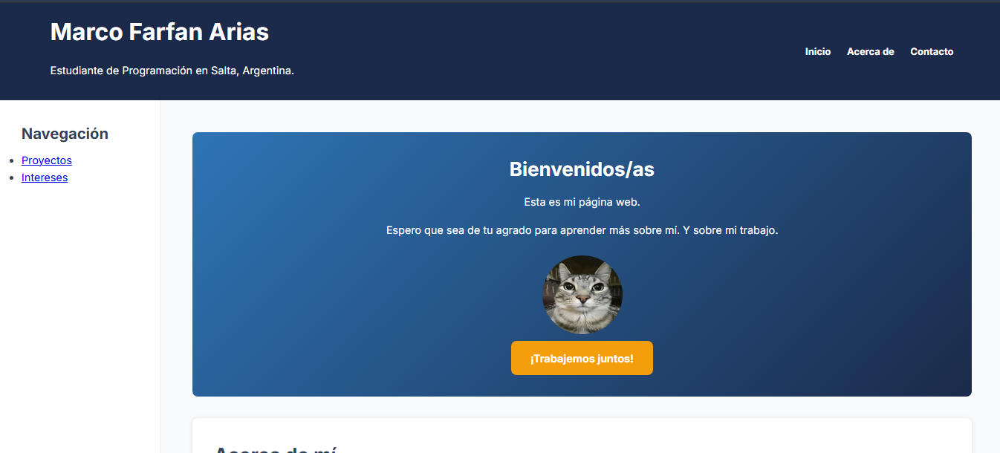

# Mi Proyecto - Portafolio Personal (Trabajo Practico Integrador)
### IES 6001 "Gral. M. Belgrano"
**Estudiante:** Marco Farfán Arias  
**Carrera:** Analista de Sistemas y Desarrollo web 

##  Sitio en Vivo

Puedes ver el proyecto desplegado aquí:  
https://marcofarias22.github.io/Tp1-mi-sitio1/

##  Tecnologías y Requisitos Cumplidos

- **HTML5 Semántico:** Uso de `header`, `aside`, `main`, `footer`, y `article`.
- **CSS3 Moderno:** Implementación de variables, Flexbox y **CSS Grid (Grid Areas)**.
- **Diseño Responsivo:** Adaptado para Mobile, Tablet y Desktop (3 breakpoints).
- **Galería Dinámica:** Uso de `grid-template-columns: repeat(auto-fit, minmax(...))`.
- **Formulario Validado:** Campos obligatorios con restricciones de longitud y formato.

## 📱 Capturas de Pantalla

